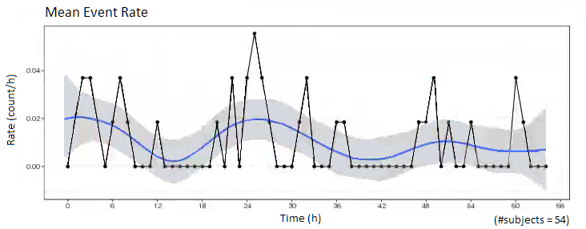

Rmarkdown template to generate this page can be found on [Rmarkdown-Template](Rmarkdown/Multiple_Ascending_Dose_PD_time_to_event.Rmd).

## Setup

```{r, echo = TRUE, warning=FALSE, message=FALSE}
# remove reference to home directory in libPaths
.libPaths(grep("home", .libPaths(), value=TRUE, invert=TRUE))

# add localLib to libPaths for locally installed packages
.libPaths(c("localLib", .libPaths()))

# will load from first filepath first, then look in .libPaths for more packages not in first path
# version matches package in first filepath, in the case of multiple instances of a package

# library(rmarkdown)
library(gridExtra)
library(grid)
library(ggplot2)
library(dplyr)
library(RxODE)
library(caTools)

theme_set(theme_bw(base_size=12))

```

# Single Time-to-event (e.g. survival)
Single time-to-event plots should be summarized by Kaplan-Meier plots and stratified by dose to give an overview of the dose-response

```{r warning=FALSE}
library(survival)
km_data <- lung %>%
  dplyr::rename(dose = ph.ecog)
km_fit <- survfit(Surv(time) ~ dose, data = km_data)
# summary(km_fit)
km_fit2 <- summary(km_fit, times = c(1,30,60,90*(1:10)))
data = data.frame(time =km_fit2$time, 
                  surv= km_fit2$surv, 
                  dose = km_fit2$strata) %>%
  mutate(dose = stringr::str_replace(dose,"dose=","")) %>%
  filter(dose!="3")

gg <- ggplot(data, aes(x=time, y=surv, color = factor(dose)))
gg <- gg + geom_line(size = 1)
gg <- gg + scale_y_continuous(labels=scales::percent_format())
gg <- gg + ylab("Survival") + xlab("Time") + labs(color="Dose (mg)")
#gg <- gg + guides(color=guide_legend("")) 
gg

pp3 <- gg + theme(legend.position = "none")
```

# Repeated Time-to-event


## Provide an overview of the data

### Mean Event Rate over time

For repeated time to event data, the rate of occurance of the events can be plotted. The observed average rate of occurance would be related to the Hazard rate in a time-to-event model. 

Calculate the rate of occurance of an event as the number of events occuring within specific time intervals, average over the number of subjects being observed. 

Observe the mean event rate, do you see any patterns? Does the event rate increase or decrease over time, or at specific time points (e.g. dosing intervals, circadian rhythms)?


```{r}
# (coming soon)
```




### Mean Cumulative Function

The mean cumulative function is another way of looking at repeated time-to-event data. The mean cumulative function is the population average of the cumulative number of events over time, and would be related to the Cumulative Hazard in a time-to-event model. 

Calculate the mean cumulative function by ordering all of the events by increasing time, calculate the cumulative number of occurances up to each time point, and take the average over the number of subjects being observed. For repeated time-to-event data, the mean cumulative function can achieve values greater than 1.

```{r}
# (coming soon)
```


## Explore Dose-Response Relationship

(coming soon)

## R Session Info
```{r}
sessionInfo()
```