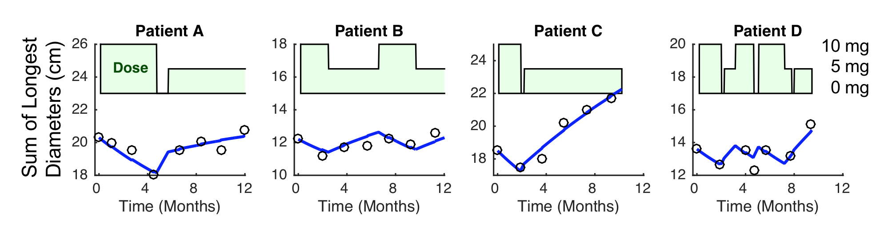

## Overview
  
The purpose of this document is to provide exploratory plots and R code for assessing dose-response and exposure-response using the RECIST (Response Evaluation Criteria In Solid Tumors) endpoint data.  These plots provide insight into whether a dose-response relationship is observable.  In Phase 1, often no dose-response relationship is observed due to high inter-subject variability.  In that situation, we recommened that no longitudinal, NLME modeling be performed as it is unlikely to add much value.  Furthermore, even if an exposure-response relationship is detected, it must be interpreted with extreme caution when it cannot be confirmed with simple explortaory graphics. 

The plots presented here are based on blinded merged RECIST data ([download dataset](Data/Oncology_Efficacy_Data.csv)) with nmpk and and dose history datasets ([download dataset](Data/Oncology_Efficacy_Dose.csv)). Data specifications can be accessed on [Datasets](Datasets.html) and Rmarkdown template to generate this page can be found on [Rmarkdown-Template](Rmarkdown/Oncology_Efficacy_Plots.Rmd).

Standard statistical plots for summarizing recist (e.g. Waterfall) are presented elsewhere.

## Setup

```{r, echo = TRUE, warning=FALSE, message=FALSE}
library(ggplot2)
library(dplyr)
library(tidyr)
library(gridExtra)
library(zoo)
library(xgxr)

#flag for labeling figures as draft
status = "DRAFT"

## ggplot settings
xgx_theme_set()
```

## Load Dataset


```{r, warning=FALSE, message=FALSE}
my.data <- read.csv("../Data/Oncology_Efficacy_Data.csv")
dose_record <- read.csv("../Data/Oncology_Efficacy_Dose.csv")
my.data$DOSE_label <- paste(my.data$DOSE_ABC,"mg")

my.data = my.data %>%
  arrange(DOSE_label) %>%
  mutate(DOSE_label_low2high      = factor(DOSE_label, levels = unique(DOSE_label)),
         DOSE_label_high2low      = factor(DOSE_label, levels = rev(unique(DOSE_label))))

#ensure dataset has all the necessary columns
my.data = my.data %>%
  mutate(IDSHORT      =  IDSHORT,         #ID   column
         BOR          =  BOR,             #Best Overal Response
         BPCHG        =  BPCHG,           #Best Percent Change from Baseline
         OR           =  OR   ,           #Overall Response
         BORNUM       =  BORNUM,          #Best Overall Response Value
         psld         =  psld,            #Percent Change in Sum of Longest Diameters
         DOSE_ABC     =  DOSE_ABC,        #Dose of Agent 1 (numeric)
         DOSE_DEF     =  DOSE_DEF,        #Dose of Agent 2 (numeric)
         DOSE_combo   =  DOSE_combo,      #ARM of the study (character)
         binary_BOR   =  binary_BOR,      #Binary Best Overall Response
         PR_rate      = PR_rate,          #Partial Response rate
         n            = n,                #The number of total subjects in each dose group
         count_cr_pr  = count_cr_pr,      #Count the number of CR or PR subjects in each dose group
         TIME         = TIME,             #Evaluation time
         TIME_OR      = TIME_OR,          #Overall Response evaluation time
         auc0_24      = auc0_24,          #AUC-24
         )

dose_record = dose_record %>%
  mutate(IDSHORT      =  IDSHORT,         #ID column
         DOSE         =  DOSE,            #Dose amount
         TIME         = TIME,             #Dosing time
         COMB         = COMB,             #Single agent or combo
         )

# make single agent and combo datsets
my.data.monotherapy = my.data %>% filter(COMB=="Single")
my.data.combo = my.data %>% filter(COMB=="Combo")

# Dose record data preparation for making step function plot
# in order to show any dose reduction during the study
# the idea is that at each time point, you have both the current dose and the previous dose
# the dplyr::lag command implements this
data_areaStep <- bind_rows(old = dose_record,
                           new = dose_record %>% 
                 group_by(IDSHORT) %>% 
                 mutate(DOSE = lag(DOSE)),
                        .id  = "source") %>%
                 arrange(IDSHORT, TIME, source) %>%
  ungroup() %>%
  mutate(DOSE = ifelse(lag(IDSHORT)!=IDSHORT, NA, DOSE), 
          TIME = TIME/24) #convert to days

data_areaStep.monotherapy = filter(data_areaStep,COMB=="Single")

# calculate average dose intensity up to the first assessment:
# "TIME==57"" is the first assessment time in this dataset
first.assess.time = 57
dose_record <- dose_record %>%
  group_by(IDSHORT) %>%
  mutate(ave_dose_intensity = mean(DOSE[TIME/24 < first.assess.time]))

dose_intensity <- dose_record[c("IDSHORT","COMB","ave_dose_intensity")]
dose_intensity <- subset(dose_intensity, !duplicated(IDSHORT))

#units and labels
time_units_dataset     = "hours"
time_units_plot        = "days"
trtact_label           = "Dose"
dose_label             = "Dose (mg)"
time_label             = "Time(Days)"
timemonth_label        = "Time (months)"
sld_label              = "Percent Change in\nSum of Longest Diameters"
sadose_label           = "ABC123 Dose (mg)"
combodose_label        = "DEF456 Dose (mg)"
bpchg_label            = "Best Percent Change \n in Tumor Size (%)"
saauc_label            = "ABC123 AUC0-24 (ng.h/ml)"
saaveauc_label         = "Average ABC123 dose (mg) \n up to the first assessment"
bpchgfirstassess_label = " Percent Change in Tumor Size \n up to the first assessment"
rr_label               = "Response Rate (%)"

#directories for saving individual graphs
dirs = list(
parent_dir= tempdir(),
rscript_dir  = "./",
rscript_name = "Example.R",
results_dir  = "./",
filename_prefix   = "",
filename     = "Example.png")
```

## Introduction to RECIST

RECIST (Response Evaluation Criteria in Solid Tumor) uses an image-based assessment from X-ray Computed Tomography (CT) scans. and has three components: 
  
  1. Sum of the longest diameter of the target lesions (continuous measure), 
2. Assessment of the non target lesions (categorical measure), and 
3. Appearance of a new lesion (binary yes/no measure).  

An example patient and the criteria for assigning a response category, is shown below.

{width=80%}


{width=80%}


## Overview of all data

### Spaghetti plots of change from baseline
We recommend stratifying the spaghetti plots of target lesion kinetics by dose so that one can observe if there is more tumor shrinkage at the higher dose groups.  In this case, no obvious relationship is observed and it is likely a longitudinal model will not be helpful.


```{r, cache = TRUE, fig.width = 8, fig.height = 4, warning = FALSE, message= FALSE} 
gg <- ggplot(data= my.data.monotherapy,aes(x=TIME, y=psld)) 
gg <- gg + geom_line(aes(group=IDSHORT, color =factor(DOSE_label_high2low)))
gg <- gg + geom_point(alpha=.3,colour="black")
gg <- gg + guides(color=guide_legend(""),fill=guide_legend(""))
gg <- gg + geom_hline(yintercept = 0.0, linetype="dashed")
gg <- gg + xgx_scale_x_time_units(units_dataset = "day", units_plot ="month")
gg <- gg + theme(text = element_text(size=15))
gg <- gg + labs(x= timemonth_label, y= sld_label)
gg <- gg + xgx_annotate_status(status)
gg
```


### Change from baseline plot, faceted by Dose

```{r, cache = TRUE, fig.width = 10, fig.height = 3, warning = FALSE, message= FALSE}
gg <- ggplot(data=my.data.monotherapy,aes(x=TIME, y=psld)) 
gg <- gg + geom_line(aes(group=IDSHORT))
gg <- gg + geom_point(alpha=.3,colour="black")
gg <- gg + guides(color=guide_legend(""),fill=guide_legend(""))
gg <- gg + facet_grid(~DOSE_label)
gg <- gg + geom_hline(yintercept = 0.0, linetype="dashed")
gg <- gg + theme(text = element_text(size=15))
gg <- gg + xgx_scale_x_time_units(units_dataset = "day", units_plot ="month")
gg <- gg + labs(x= timemonth_label, y= sld_label)
gg <- gg + xgx_annotate_status(status)
gg
```


### Individual plots of percent change from baseline, including dosing history, labeled by "Overall Response"

These plots allow one to look for subtle trends in the individual trajectories.  If changes in the tumor trajectory occur often after a dose reduction, a longitudinal model may be useful for assessing dose-response.  However, caution is needed because both dose reductions and resistance acquisition can occur at later times and it may not be easy to deterimne which is the cause of the change in tumor trajectory.

In the first plot below, it is difficult to see a trend of dose changes impacting response and a longitudinal tumor-size model will likely not be informative.  But in the second plot below, a trend of tumor shrinkage followed by tumor growth after a dose reduction was observed and a longitudinal model was useful for characterizing this data.  [see reference](https://bmccancer.biomedcentral.com/articles/10.1186/1471-2407-12-311)

Example 1, longitudinal model won't be informative:
```{r, cache = TRUE, fig.width = 10, fig.height = 14, warning = FALSE, message= FALSE}
# This part is optional to label "OR" in the plot
# "OR" can be substituted with other information, such as non-target, new target lesions
#  make the OR label for the plot

my.data.label <- my.data %>%
  group_by(IDSHORT) %>%
  mutate(label_psld = as.numeric(ifelse(TIME==TIME_OR , psld,""))) %>%
  filter(!(is.na(label_psld) | label_psld==""))


dose_shift = 50
dose_scale = 1.2
data_areaStep.monotherapy = data_areaStep.monotherapy %>%
  mutate(dose_shift = DOSE/dose_scale+dose_shift)

dose_unique = c(0,unique(my.data.monotherapy$DOSE_ABC))

data_tumor = my.data.monotherapy
data_dose_step = data_areaStep.monotherapy

gg <- ggplot(data = data_tumor)
gg <- gg + geom_point(mapping = aes(y= psld, x= TIME))
gg <- gg + geom_text(data= my.data.label,aes(y= label_psld, x= TIME_OR, label=OR), vjust=-.5)
gg <- gg + geom_hline(aes(yintercept = 0),size=0.25,linetype="dashed", colour="red")
gg <- gg + geom_line(mapping = aes(y= psld, x= TIME))
gg <- gg + geom_ribbon(data = data_dose_step,
                       aes( ymin = 50, ymax = dose_shift , x= TIME),
                       fill="palegreen2", color = "black", alpha=0.5 )
gg <- gg + facet_wrap(~IDSHORT, ncol = 6)
gg <- gg + labs(y = sld_label, x= timemonth_label)
gg <- gg + xgx_scale_x_time_units(units_dataset = "day", units_plot ="month")
gg <- gg + scale_y_continuous(
  sec.axis = sec_axis(~(.-dose_shift)*dose_scale, name = "Dose(mg)", breaks = dose_unique))
gg <- gg + theme(text = element_text(size=15))
gg <- gg + xgx_annotate_status(status)
gg
```


Example 2, dose reduction was followed by growth of tumor and longitudinal model would help.

{width=100%}


## Dose-Response: Monotherapy

To visualize dose-response (exposure-response), we recommend plotting the assigned dose group (or exposure) vs best overall change in tumor size.  

**Warning:** If you see what appears to be a linear dose-response relationship (e.g. more tumor shrinkage with increasing dose), be very cautious when trying to extrapolate outside this range, as Emax may not have been observed yet.

```{r, cache = TRUE, fig.width = 8, fig.height = 4, warning = FALSE, message= FALSE} 
gg <- ggplot()
gg <- gg + geom_point(data=my.data.monotherapy,aes(x=DOSE_ABC,y=BPCHG),color="tomato")
gg <- gg + scale_x_continuous(breaks=unique(my.data.monotherapy$DOSE_ABC))
gg <- gg + geom_hline(yintercept=0,color="grey50", linetype = "dashed")
gg <- gg + scale_y_continuous(labels=scales::percent)
gg <- gg + labs(x=sadose_label, y=bpchg_label)
gg <- gg + theme(legend.title=element_blank())
gg <- gg + theme(text = element_text(size=15))
gg <- gg + xgx_annotate_status(status)
gg
```

```{r, cache = TRUE, fig.width = 8, fig.height = 4, warning = FALSE, message= FALSE} 
gg <- ggplot()
gg <- gg + geom_point(data=my.data.monotherapy,aes(x=auc0_24,y=BPCHG), color="tomato")
gg <- gg + geom_hline(yintercept=0,color="grey50", linetype = "dashed")
gg <- gg + scale_y_continuous(labels=scales::percent)
gg <- gg + labs(x=saauc_label, y=bpchg_label)
gg <- gg + theme(legend.title=element_blank())
gg <- gg + theme(text = element_text(size=15))
gg <- gg + xgx_annotate_status(status)
gg
```

Best overall change is commonly reported in Waterfall plots.  And the reason we recommend using the randomized dose group as opposed to something like average dose-intensity is that the latter can be confounded.  For instance, consider the following scenario.  There are two patients that both start at 10 mg.  One has 30% tumor growth at the first assessment and progresses.  The other responds, but at month 6, they are dose reduced to 5 mg due to an adverse event, and then followed for another 6 months.  In this case, the responder would have a dose intensity of 7.5 mg while the non-responder had a dose-intensity of 10 mg, and thus one might conclude from a simple plot of these two patients that lower doses are better.

One way to avoid this issue is to plot average dose intensity up to the first assessment vs percent change at the first assessment and this could be considered if there are a large number of dose reductions before the first assessment.

```{r, cache = TRUE, fig.width = 8, fig.height = 4, warning = FALSE, message= FALSE} 
# Do it only for monoteraphy, it can be repeated for combo
dose_intensity <- dose_intensity[dose_intensity$COMB=="Single",]
my.data.assessment <-  my.data.monotherapy %>%
  merge(dose_intensity  ,by="IDSHORT")

gg <- ggplot()
gg <- gg + geom_point(data=my.data.assessment %>% subset(TIME==first.assess.time,),
                      aes(x=ave_dose_intensity ,
                          y=psld),color="tomato")
gg <- gg + scale_x_continuous(breaks=c(20,40, 60, 74,78,90))
gg <- gg + geom_hline(yintercept=0,color="grey50", linetype = "dashed")
gg <- gg + labs(x=saaveauc_label, y= bpchgfirstassess_label)
gg <- gg + theme(legend.title=element_blank())
gg <- gg + theme(text = element_text(size=15))
gg <- gg + xgx_annotate_status(status)
gg
```


## Dose-Response: Combo

When two drugs are combined (ABC123 + DEF456), it can be a useful first step to look at the dose-response relationship of each drug.  However, it should be noted that provide only a limited understanding of the data.


```{r, cache = TRUE, fig.width = 10, fig.height = 5, warning = FALSE, message= FALSE} 
gg <- ggplot()
gg <- gg + geom_point(data=my.data.monotherapy,aes(x=DOSE_ABC,y=BPCHG, color="ABC123"))
gg <- gg + geom_point(data=my.data.combo,aes(x=DOSE_ABC,y=BPCHG, 
                                          color = factor(DOSE_DEF, labels = c("ABC123 + 400 mg DEF456", "ABC123 + 300 mg DEF456"))))
gg <- gg + labs(color = "DEF456 (mg) dose")
gg <- gg + geom_hline(yintercept=0,color="grey50", linetype = "dashed")
gg <- gg + scale_x_continuous(breaks=unique(my.data.monotherapy$DOSE_ABC))
gg <- gg + labs(x=sadose_label,y=bpchg_label)
gg <- gg + scale_y_continuous(labels=scales::percent)
gg <- gg + theme(legend.title=element_blank())
gg <- gg + theme(text = element_text(size=15))
gg <- gg + xgx_annotate_status(status)
gg
```


```{r, cache = TRUE, fig.width = 10, fig.height = 5, warning = FALSE, message= FALSE} 
gg <- ggplot(data=my.data.combo,aes(x=DOSE_DEF,y=BPCHG))
gg <- gg + geom_point(aes( color= factor(DOSE_ABC,labels=c("+ 60 mg ABC123",
                                                           "+ 40 mg ABC123",
                                                           "+ 20 mg ABC123"))))
gg <- gg + geom_hline(yintercept=0,color="grey50", linetype = "dashed")
gg <- gg + scale_x_continuous(breaks=unique(my.data.combo$DOSE_DEF))
gg <- gg + labs(x=combodose_label,y=bpchg_label)
gg <- gg + scale_y_continuous(labels=scales::percent)
gg <- gg + theme(legend.title=element_blank())
gg <- gg + theme(text = element_text(size=15))
gg <- gg + xgx_annotate_status(status)
gg
```

### Responder rate (95% CI) vs dose

For most of the oncology clinical trials, the standard primary and secondary endpoints are Overall Survival (OS), Progression Free Survival (PFS), duration without progression (PD) or death, and Overall Response Rate (ORR). Dose vs ORR at each dose can be informative.

```{r, cache = TRUE, fig.width = 8, fig.height = 5, warning = FALSE, message= FALSE}
gg <- ggplot(data = my.data.combo, aes(x=DOSE_ABC,y=PR_rate))
gg <- gg + xgx_stat_ci(mapping = aes(x = DOSE_ABC, y = binary_BOR ,group=DOSE_ABC), 
                       conf_level = 0.95, distribution = "binomial", geom = c("point"), size = 4, color="tomato")
gg <- gg + xgx_stat_ci(mapping = aes(x = DOSE_ABC, y = binary_BOR , group=DOSE_ABC), 
                       conf_level = 0.95, distribution = "binomial", geom = c("errorbar"), size = 0.5)
gg <- gg + scale_x_continuous(breaks=unique(my.data[my.data$COMB=="Combo",]$DOSE_ABC))
gg <- gg + scale_y_continuous(labels=scales::percent)
gg <- gg + labs(x= sadose_label, y= rr_label)  
gg <- gg + theme(text = element_text(size=15))
gg <- gg + xgx_annotate_status(status)
gg
```


### Best Overall Response (BOR) plot for combo therapy

```{r, cache = TRUE, fig.width = 14, fig.height = 7, warning = FALSE, message= FALSE}
gg <-  ggplot(data=my.data.combo,aes(x=DOSE_ABC ,y=DOSE_DEF,fill=PR_rate))
gg <- gg + scale_fill_gradient(low="orange", high="green")
gg <- gg + geom_segment(data=my.data.combo, aes(x=-Inf,xend=20,y=30,yend=30), color=rgb(0.5,0.5,0.5))
gg <- gg + geom_segment(data=my.data.combo, aes(x=20,xend=20,y=-Inf,yend=30), color=rgb(0.5,0.5,0.5))
gg <- gg + geom_segment(data=my.data.combo, aes(x=-Inf,xend=40,y=30,yend=30), color=rgb(0.5,0.5,0.5))
gg <- gg + geom_segment(data=my.data.combo, aes(x=40,xend=40,y=-Inf,yend=30), color=rgb(0.5,0.5,0.5))
gg <- gg + geom_segment(data=my.data.combo, aes(x=-Inf,xend=60,y=30,yend=30), color=rgb(0.5,0.5,0.5))
gg <- gg + geom_segment(data=my.data.combo, aes(x=60,xend=60,y=-Inf,yend=30), color=rgb(0.5,0.5,0.5))
gg <- gg + geom_segment(data=my.data.combo, aes(x=-Inf,xend=40,y=40,yend=40), color=rgb(0.5,0.5,0.5))
gg <- gg + geom_segment(data=my.data.combo, aes(x=40,xend=40,y=-Inf,yend=40), color=rgb(0.5,0.5,0.5))
gg <- gg + geom_label(data=unique(my.data.combo[,c("DOSE_DEF","DOSE_ABC","PR_rate","n","count_cr_pr")]),
                      aes(x=DOSE_ABC ,y=DOSE_DEF*1.00,fontface=2, label=paste0(round(PR_rate,2)*100,
                                                                               "% ORR \nn=",n,"\nn(CR|PR)=",count_cr_pr)))
gg <- gg + scale_x_continuous(breaks=c(20, 40, 60)) 
gg <- gg + scale_y_continuous(breaks=c(30, 40)) 
gg <- gg + labs(x=sadose_label , y= combodose_label)
gg <- gg + theme(legend.title = element_blank(), 
                 plot.title=element_text(hjust=0.5),
                 text = element_text(size=20),
                 title = element_text(size=20))
gg <- gg + guides(fill=FALSE)
gg <- gg + xgx_annotate_status(status)
gg 
```


## R Session Info
```{r}
sessionInfo()
```