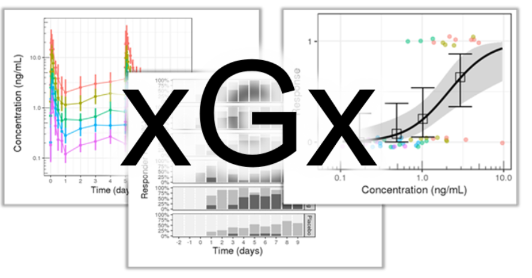

## Overview {data-progressive=TRUE}

{ width=100% }

<p style="font-weight:600; font-size:32px">
xGx/xGxr: Tools for the exploration of PKPD datasets.</p>

Exploratory graphics provide a quick visual solution to check your data for any 
anomalies and give the user a simple overview of the data structure.
This is particularly helpful in PKPD analysis as a step 
prior to making more complex models.

The open source packages `xgx` and `xgxr` are targeted specifically towards
exploratory graphics of PKPD analyses, with a focus to improve 
efficiency, code readability, exploratory graphic consistency, 
and act as an educational resource for PKPD analyses.


<p style="font-weight:600; font-size:16px">What types of questions can we 
answer with exploratory graphics for PKPD?</p>

### Pharmokinetic Relevant Questions
#### Longitudinal trends
  - How many compartments are observed within the data?
  - Is the clearance nonlinear?
    - (e.g. Is there a discontinuity / drop in elimination phase in log space?)

These question may be addressed in PK data by plotting the mean and confidence intervals over time,
grouped by does or assigned treatment.

 - Logarithmic scaling helps identify the number of compartments,
     linearity of elimination, and better general plot visualizations.
 - Linear scaling allows better attention towards the $C_{max}$, 
     which can be important if there is a narrow therapeutic window 
     and if $C_{max}$ is important in determining safety.

An example of a PK plot used to answer these question is given in our 
[PK - Multiple Ascending Dose template](https://opensource.nibr.com/xgx/Multiple_Ascending_Dose_PK.html#concentration_over_time,_colored_by_dose,_mean_+-_95%_ci):

```{r PK_plot1, exercise=TRUE, exercise.lines = 6, exercise.eval=TRUE, fig.height=3, fig.width=8, warning=FALSE}
gg <- ggplot(data = pk_data, 
             aes(x = NOMTIME,
                 y = LIDV, 
                 group = interaction(TRTACT_high2low, PROFDAY),
                 color = TRTACT_high2low)) 
gg <- gg + xgx_theme()
gg <- gg + xgx_geom_ci(conf_level = 0.95,
                       alpha = 0.5)
gg <- gg + xgx_scale_y_log10()
gg <- gg + xgx_scale_x_time_units(units_dataset = time_units_dataset, 
                                  units_plot    = time_units_plot)
gg <- gg + labs(y = conc_label, color = trtact_label) 
gg <- gg + xgx_annotate_status(status)
print(gg)
```

<!-- { width=100% } -->


#### Dosage trends
  - PK linearity - Is dose-normalized AUC or $C_{max}$ consistent across dosages? 
    (This provides information regarding how dosage adjustments affect response)

If the normalized concentration across doses is observed to increase with 
increasing dosages, this may indicate a nonlinear clearance.  
Conversely, if the lowest dosage is associated with a larger and more 
variable normalized concentration, this may be an indication that the 
signal to noise ratio is low 
- i.e. the data is close to the lower limit of detection.

An example of the type of plot which is helpful to answer these questions is 
given in our [PK - Single Ascending Dose template](https://opensource.nibr.com/xgx/Single_Ascending_Dose_PK.html#nca_of_dose_normalized_auc_and_cmax_vs_dose):

{ width=100% }


### Pharmacodynamic Relevant Questions

Questions relevant to the pharmacodynamics of a study are dependent 
upon the PD data type (e.g. continuous, binary, or ordinal)

#### Longitudinal trends
  - How quickly is a steady state reached?

#### Dosage trends
  - Is the PD response, efficacy, or safety a function of dose?
  - Is the dosage large enough to reach an asymptote?
  - What is the $E_{max}$ or $ED_{50}$?


An example of the type of plot which is helpful to answer these questions is 
given in our [PD, Dose-Response - Binary Response template](https://opensource.nibr.com/xgx/Multiple_Ascending_Dose_PD_binary.html#responder-rate-95-ci-by-dose-for-endpoint-of-interest"):

{ width=100% }

### Questions about Sources of Variablility

#### Inter-subject variability
Between-subject variability can be easily visualized as a spaghetti plot, 
as we have shown in our [Single Ascending Dose PK template](https://opensource.nibr.com/xgx/Single_Ascending_Dose_PK.html#explore_covariate_effects_on_pk)

Single_Ascending_Dose_PK.html#explore_covariate_effects_on_pk
{ width=100% }

#### Intra-subject variability

Within-subject variability is most simply viewed as a spaghetti plot, that 
has been faceted by the individual, such as the one shown below:

{ width=100% }

#### Explained vs Unexplained Variability
  * Explained variability
    - Between-subject:
      - Traditional covariates
    - Within-subject:
      - Circadian rhythms, seasonal effects, food effects, disease progression
  * Explained variability
    - Between-subject:
      - Unaccounted for covariates
    - Within-subject:
      - Residual error, poor absorption, other unaccounted for effects
